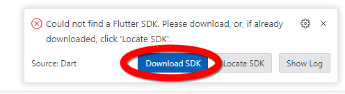
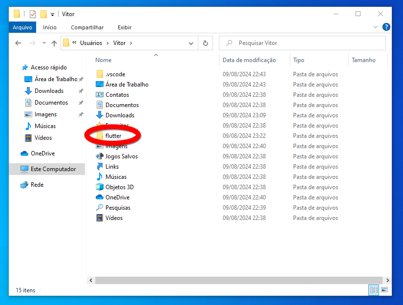
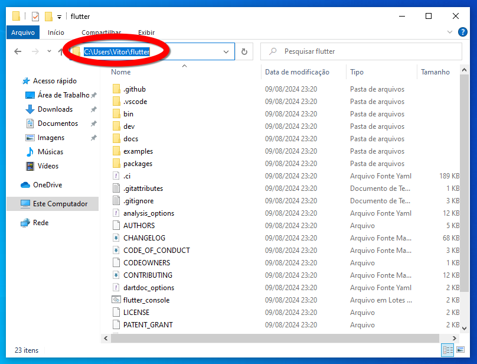
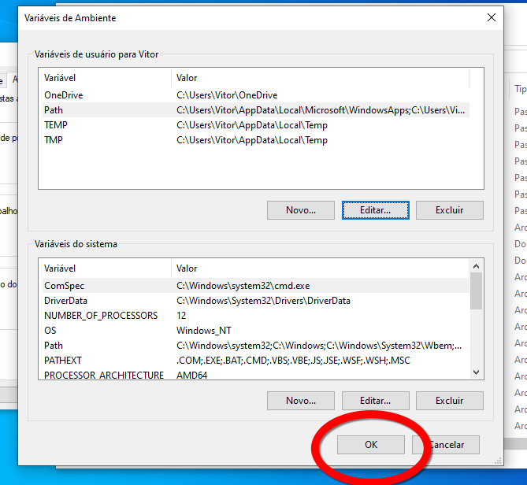
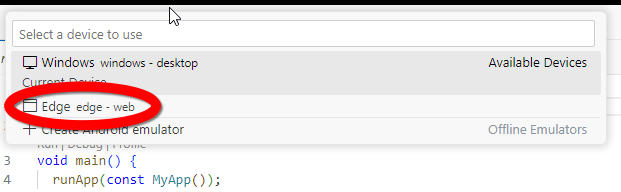
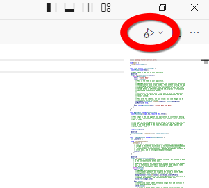

# Introdução

## Como instalar o Flutter no Windows

### Extensão do Flutter no VS Code

Primeiro, você irá precisar instalar o VS Code para instalar o flutter de forma automática.

Após instalar o VS Code, você irá precisar instalar a extensão do Flutter para o VS Code.

### Instalando o SDK do Flutter

Depois de instalar a extensão,vamos instalar agora o Flutter no nosso computador. Para isso, precisamos precionar `ctrl + sifht + p` e digitar `flutter`. Selecione a opção `Flutter: Run Flutter Doctor`.

Assim, irá aparecer uma pequana janela no canto inferior direito, informando que não foi possível localizar o SDK do Flutter. Dessa forma, iremos selecionar a opção de `Download SDK`.

Agora precisamos escolher o local de instalação do SDK do Flutter. Escolha uma pasta de sua escolha. Você pode escolher a pasta do seu usuário sem problemas.

Agora, precisamos esperar a extensão baixar o Flutter.

A função Flutter Doctor verifica se a instalação do Flutter no nosso computador está funcionando da maneira correta.

### Adicionando o SDK do Flutter ao PATH

Após todo esse processo, precisamos adicionar também a pasta do SDK do Flutter em nosso PATH, para que possamos acessar o Flutter pelo terminal, além de fornecer o caminho para que a extensão do Flutter trabalhe corretamente.

Para isso, vamos precisar do caminho para a pasta do SDK do Flutter.

Vá até a pasta.

Entre nela e clique na barra superior onde aparece o caminho até a pasta.

Copie o caminho da pasta.

Abra o menu iniciar e pesquise por `Variáveis de ambiente`. Clique na primeira opção que aparecer.

Clique em `Variáveis de ambiente`. 

Selecione a variável `Path` e clique em `Editar`. 

Clique em `Novo` e cole o caminho que você copiou e adicione no final dele `\bin`.

Clique em `Ok` até sair da primeira janela que você abriu.

Agora, o Flutter já está instalado na sua máquina e o seu caminho já está no PATH.

## Criando um novo projeto

Para criar um novo projeto, precisamos executar o comando `Flutter: New Project` no VS Code. Para isso, precisamos precionar novamente `ctrl + shift + p` e digitarmos `flutter`. Agora, nós escolhemos o `Flutter: New Project`.

Podemos escolher várias opções de templates, mas vamos escolher o template `Application`. 

Logo após, precisamos escolher o local do nosso projeto. Escolha a pasta de sua escolha.

Dê um nome a sua aplicação.

O VS Code irá automaticamente abrir a pasta do projeto.

### Rodando o projeto na versão Web

Para testarmos o projeto, vamos rodá-lo na versão WEB do projeto. Como o Edge já vem pré-instalado, podemos testá-lo através dele. Para isso, precisamos escolher o dispositivo em que o projeto irá executar. Para isso, vamos no canto inferior direito do VS Code, e vamos clicar no botão ao lado do botão de notificações e do lado do botão da linguagem do arquivo aberto.

Agora, vamos selecionar a opção do Edge.

Assim, agora só precisamos executar a aplicação, clicando no botão de play no canto superior direito do VS Code.

Assim, a aplicação irá abrir no Edge, ou em qualquer device que você escolher.

